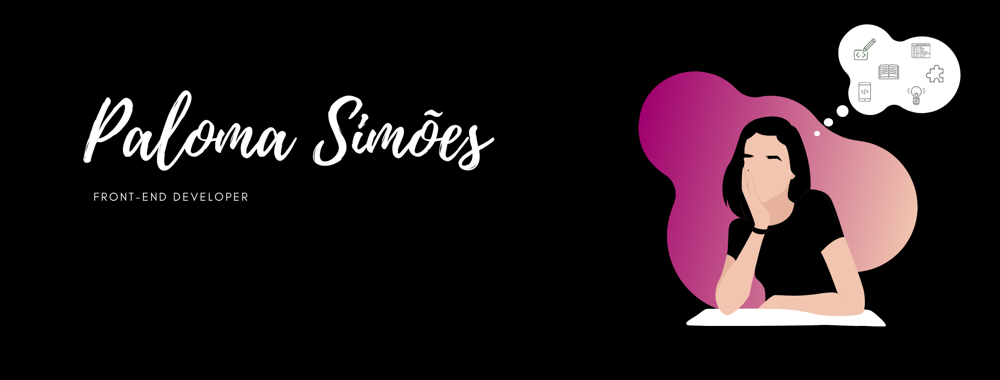

# Saudações! :smile: 

:computer: Trabalho com desenvolvimento front-end desde 2019.  
:mortar_board: Fui graduanda do curso de Sistemas de Informação na Faculdade Impacta, entre 2016 e 2018. Não cheguei a concluí-la.  
:pencil: Utilizo as seguintes tecnologias: HTML, CSS, JavaScript, SASS, JQuery.  
:notebook: Atualmente, estou estudando Vue, Nodejs, SQL, Cypress e PHP.  
:ok_woman: Faço parte da coordenação da comunidade Nerdzão/Nerdgirlz.   

:octocat: Alguns repositórios que tenho são inspirados em coisas que gosto, até mesmo para que meus estudos ocorram de uma maneira divertida. 
:books: Eu amo ler livros técnicos, mesmo já ouvindo falar que com o tempo deixam de ter utilidade. 
:grin: Provavelmente você confundirá meu nome em algum momento. 

